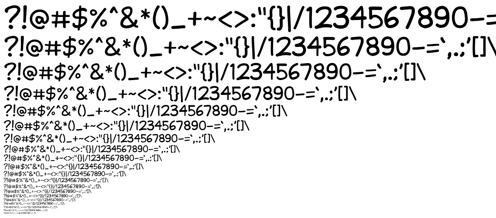

# Citrustime
A comic-style font for projects that can't license a commercial font. Not as good as the big ones, but good enough!

Download link: https://github.com/wareya/CitrustimeFont/raw/main/Citrustime.ttf

   

## About

Made in Birdfont, licensed under the OFL.

Citrustime is inspired by, but not based on, the free (for personal use) Clementine font from JibbaJabba Fonts. In turn, Clementine was inspired by the comicbook lettering of Clem Robins. A distinctive quality of this style is irregular stroke weight, which I tried to replicate.

I am not a type designer. Any type designer looking at this font will see that as obvious. I made each glyph by placing down open splines and usinb Birdfont's stroke feature, which only supports a fixed line width per curve, not per-node line width, so in the few places where single strokes have variable width, they're actually two lines piled on top of each other.

The end result is cheap-looking glyphs with round ends and a cliched style, and it's clearly inferior to commercial comic lettering fonts. But Citrustime has the advantage that you can drop it into projects that require you to redistribute the original font file, like games or webpages, without having any problems or having to pay any extra fees. Freedom!

## Examples

   
   
   

